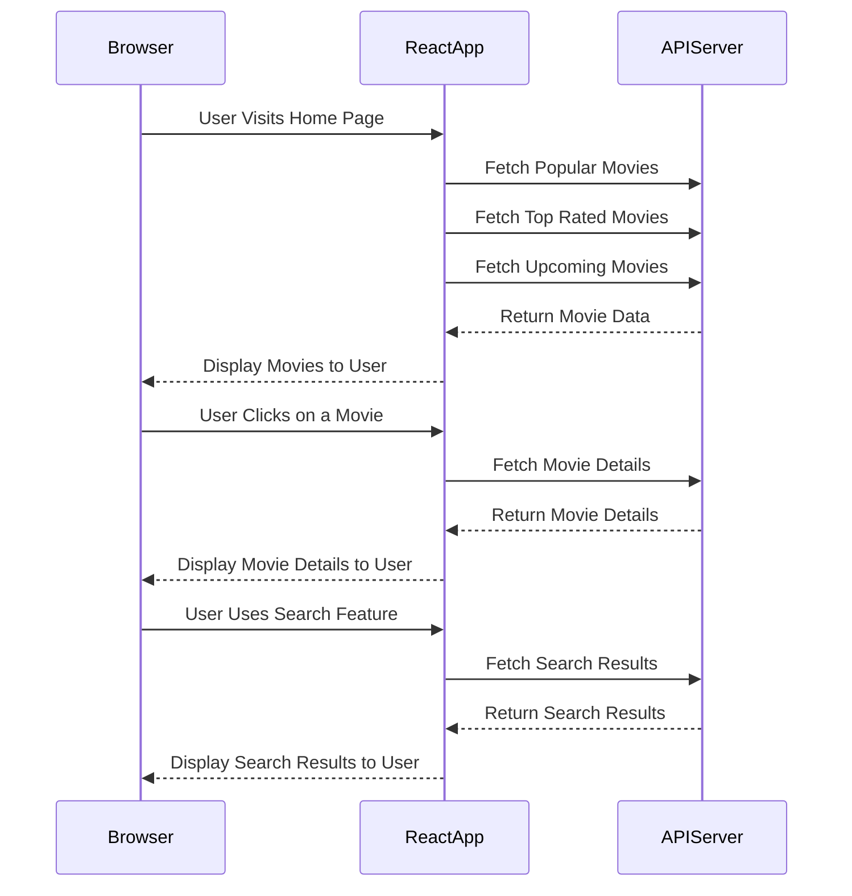
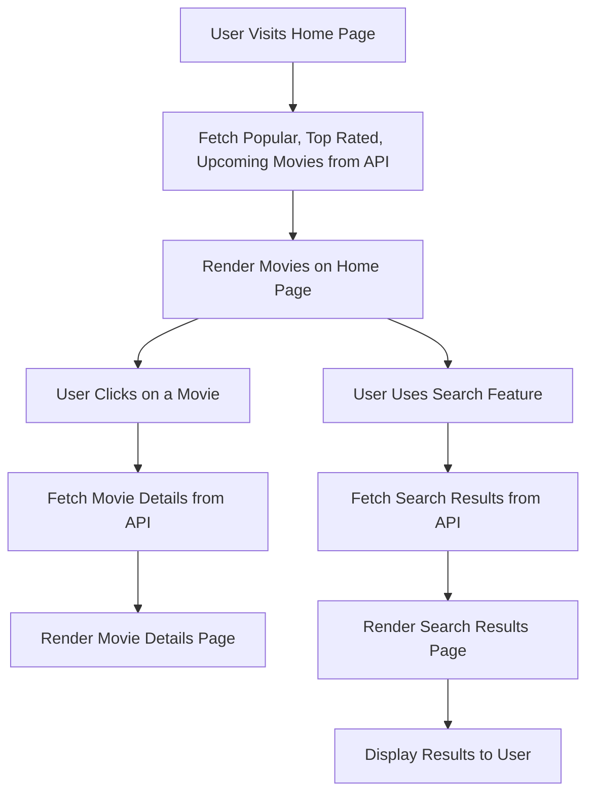

# [Movie.Info](http://movie.info/)

[Movie.Info](http://movie.info/) is a web application that provides information about popular, top-rated, and upcoming movies. Users can search for movies and view detailed information about each movie.

## Features

- Display popular, top-rated, and upcoming movies
- Search for movies
- View detailed information about each movie
- Responsive design using styled-components

## Project Structure

```
movie-info/
├── public/
│   ├── index.html
│   ├── favicon.ico
│   └── assets/
│       └── images/
│           └── path-to-your-404-animation.gif
├── src/
│   ├── components/
│   │   ├── Card/
│   │   ├── Header/
│   │   ├── Footer/
│   │   └── index.js
│   ├── hooks/
│   │   └── useFetchMovies.js
│   ├── pages/
│   │   ├── Home/
│   │   ├── Popular/
│   │   ├── TopRated/
│   │   ├── Upcoming/
│   │   ├── AllMovies/
│   │   ├── MovieDetails/
│   │   ├── PageNotFound/
│   │   ├── Search/
│   │   └── index.js
│   ├── routes/
│   │   └── AllRoutes.jsx
│   ├── services/
│   │   └── api.js
│   ├── styles/
│   │   └── globalStyles.js
│   ├── App.jsx
│   ├── App.test.js
│   ├── index.js
│   └── setupTests.js
├── .env.local
├── .gitignore
├── package.json
├── README.md
└── yarn.lock (or package-lock.json if using npm)

```

## Installation

1. Clone the repository:
    
    ```
    git clone <https://github.com/yourusername/movie-info.git>
    
    ```
    
2. Navigate to the project directory:
    
    ```
    cd movie-info
    
    ```
    
3. Install dependencies:
    
    ```
    npm install
    # or
    yarn install
    
    ```
    
4. Create a `.env.local` file in the root directory and add your TMDB API key:
    
    ```
    VITE_TMDB_API_KEY=your_api_key_here
    
    ```
    
5. Start the development server:
    
    ```
    npm run dev
    # or
    yarn dev
    
    ```
    

## Usage

- Visit `http://localhost:3000` to view the application.
- Use the navigation links to view popular, top-rated, and upcoming movies.
- Use the search feature to find specific movies.
- Click on a movie to view detailed information.

## Contributing

1. Fork the repository
2. Create a new branch (`git checkout -b feature-branch`)
3. Make your changes
4. Commit your changes (`git commit -m 'Add some feature'`)
5. Push to the branch (`git push origin feature-branch`)
6. Open a pull request

## License

[Add your chosen license here]

## Visual Component Mapping

### Sequence Diagram



### Flowchart



## Component Mapping

- **Home Component**
    - Description: Displays the main landing page with sections for popular, top-rated, and upcoming movies.
    - Data Fetching: Uses the custom hook `useFetchMovies` to fetch data for each category of movies.
    - Children Components: `Card`
- **MovieDetails Component**
    - Description: Displays detailed information about a selected movie.
    - Data Fetching: Uses the function `fetchMovieDetails` to fetch details of a specific movie.
- **Search Component**
    - Description: Allows users to search for movies.
    - Data Fetching: Uses the function `fetchSearchResults` to fetch search results based on user query.
    - Children Components: `Card`
- **Popular Component**
    - Description: Displays a list of popular movies.
    - Data Fetching: Uses the custom hook `useFetchMovies` with type `'popular'`.
    - Children Components: `Card`
- **TopRated Component**
    - Description: Displays a list of top-rated movies.
    - Data Fetching: Uses the custom hook `useFetchMovies` with type `'topRated'`.
    - Children Components: `Card`
- **Upcoming Component**
    - Description: Displays a list of upcoming movies.
    - Data Fetching: Uses the custom hook `useFetchMovies` with type `'upcoming'`.
    - Children Components: `Card`
- **AllMovies Component**
    - Description: Displays all categories of movies (popular, top-rated, upcoming) in sections.
    - Data Fetching: Uses the custom hook `useFetchMovies` for each category.
    - Children Components: `Card`
- **PageNotFound Component**
    - Description: Displays a 404 error page with an animation.
    - Children Components: None